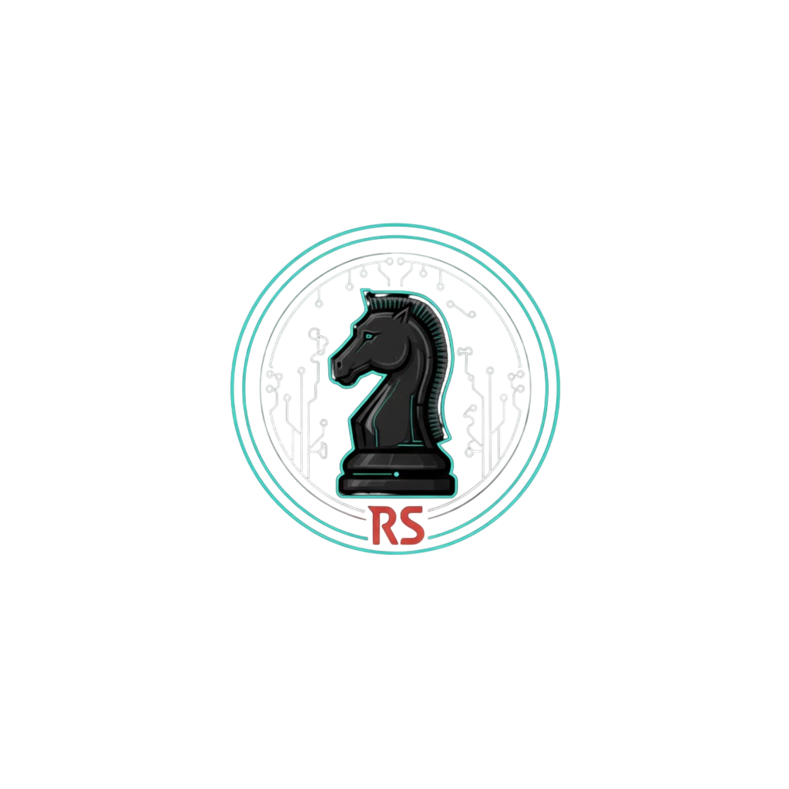

# <p align="center">♟️ COSPLAY CHESS</p>
<p align="center">
  
</p>

<p align="center">
  <b>A Engine de Batalha Definitiva para Eventos Geek</b><br>
  <i>Desenvolvido por Rubra Studios</i>
</p>

<p align="center">
  
  
  
</p>

---

## ⚡ O PROJETO
O **Cosplay Chess** não é apenas um jogo; é um sistema de sustentação para palco. Ele permite que organizadores de eventos de anime carreguem as fotos e vozes dos cosplayers em tempo real, transformando uma partida de xadrez em um duelo cinematográfico digno de um Shonen.

> [!IMPORTANT]
> **Foco do Sistema:** Imersão, Estética Glassmorphism e Performance nativa em telões de alta resolução.

---

## 🚀 FUNCIONALIDADES "GOD MODE"

### 🎨 Customização Visual (Real-Time)
* **Avatares Dinâmicos:** Carregue fotos dos competidores diretamente na interface.
* **Skins de Peças:** Cada peça (`P1` a `K1`) aceita uma imagem única em Base64.
* **Interface macOS Sequoia Style:** Design limpo, com transparências e efeitos de desfoque.

### 🔊 Sound Engine Avançada
* **Arena Audio:** Play/Pause individual para os combatentes durante o duelo.
* **Ambiente Control:** Suporte a trilhas de fundo, introduções e músicas de vitória.
* **Volume Master:** Controle centralizado para o técnico de som do evento.

### 💾 Persistência Rubra
* **Zero Perda de Dados:** O sistema utiliza **IndexedDB** de alta performance. Mesmo que o PC desligue, os personagens e o progresso da partida estarão lá ao reabrir.

---

## 🛠️ ARQUITETURA TÉCNICA

| TECNOLOGIA | FUNÇÃO |
| :--- | :--- |
| **Electron JS** | Runtime para execução como aplicativo desktop nativo. |
| **Vanilla JavaScript** | Lógica de movimentação, regras de captura e IA de áudio. |
| **CSS Glassmorphism** | Estética moderna com filtros de desfoque e bordas neon. |
| **IPC Bridge** | Comunicação entre o sistema operacional e a interface de jogo. |

---

## 🎮 OPERAÇÃO DO MESTRE (GUIDE)

1. **BOOT:** Escolha a resolução nativa do telão no menu inicial para garantir a nitidez.
2. **SETUP:** Use a sidebar `🏠` para subir as fotos dos cosplayers.
3. **COMBATE:** Ao mover uma peça sobre a outra, a **Arena** surge. Use os controles de áudio para dar emoção ao confronto antes de declarar o vencedor.
4. **MODO LIVRE:** Ative a `MOVIMENTAÇÃO LIVRE` para coreografias de palco ou ajustes rápidos.

---

## 📦 COMO COMPILAR

Se você deseja gerar o instalador `.exe`:

```bash
# 1. Instalar dependências
npm install

# 2. Rodar em modo teste
npm start

# 3. Gerar o executável final
npm run build


<p align="center">

</p>

<p align="center">
<i>"Transformando estratégia em espetáculo."</i>
</p>
